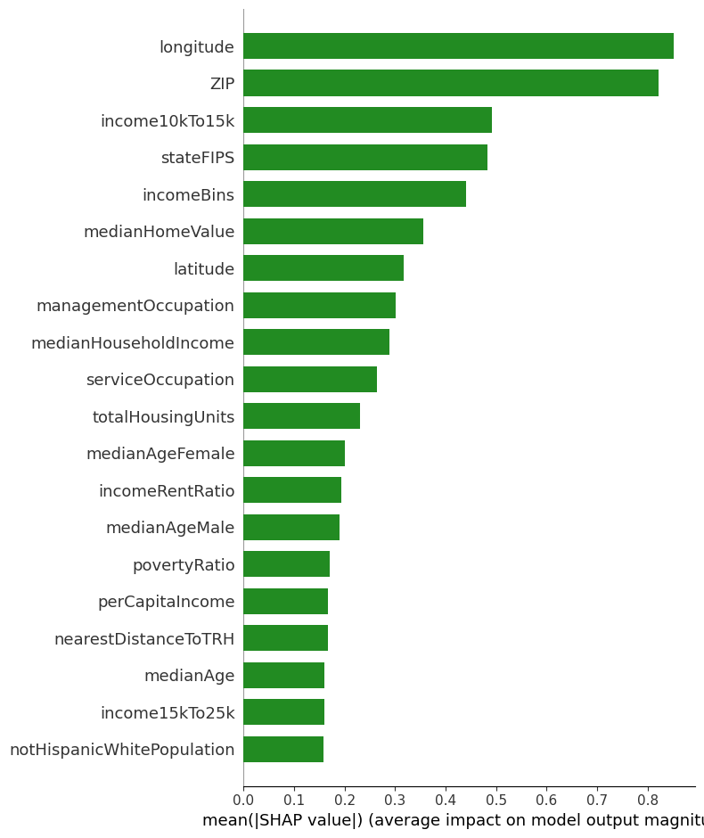
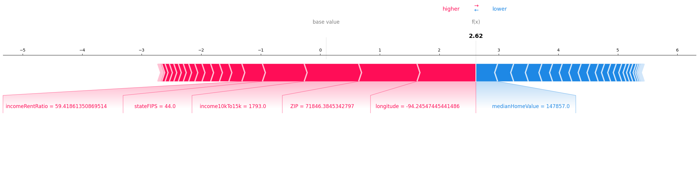

# Predicting New Locations For Texas Roadhouse Using Gradient Boosting and SHAP.

<h2>Introduction</h2>
This end-to-end machine learning project is designed to predict new locations for the restaurant chain, with a focus on states currently growing in population, such as Colorado, Montana, Idaho, Utah, and South Carolina.  
<h5>Business Use Case:</h5>
This project is designed to inform decision-making for new Texas Roadhouse locations in states with high population growth. This approach can be used for other restaurants, and in other industries, such as retail or healthcare, to figure out where to place new locations for optimized success.   
<h6>This project is not affiliated with Texas Roadhouse.</h6>

<h2>Key Results</h2>
This project delivered strong model performance and actionable recommendations for expansion:
<h4>Model Performance:</h4>
• Gradient Boosting Model: Accuracy = 82.9%, F1 Score = 82.58%, AUC-ROC = 88.56%  
• Average cross-validation F1 Score = 83.07% across all folds. 
<h4>Top Recommended Locations:</h4>
• Great Falls, MT - 96.03% success probability  
• Salt Lake City, UT - 98.39% success probability 

<h4>Tableau:</h4>

  

[Interact with the Texas Roadhouse Dashboard on Tableau Public](https://public.tableau.com/views/texasRoadhouseDashboard/Dashboard1?:language=en-US&publish=yes&:sid=&:redirect=auth&:display_count=n&:origin=viz_share_link)

<h4>PowerPoint Presentation:</h4> 

[Project Presentation](https://github.com/emilyschnepp/PredictingNewLocationsForTexasRoadhouse/blob/main/presentation/texasRoadhouse.pptx)

<h2>Prerequisites</h2>
<h4>Tableau Public</h4>
<h4>Python, with the following libraries:</h4> 
• Sklearn  
• shap  
• matplotlib  
• pandas  
• numpy  
• seaborn  
• imblearn  
• geopy  
• praw  
• math  
• statsmodels  
• requests  
• pgeocode  

<h2>Data Sources</h2> 
With respect to query limits and requests for lag times or breaks, the following APIs were used:  
 
•	Google Places API: Collected data on Texas Roadhouse locations, including ratings, total user reviews, and geographic coordinates.  
•	US Census API: Collected more than 40 variables of demographic data such as population, income levels, and housing statistics for cities with and without existing restaurant locations.  

Used the following additional resources:  
•	Census Gazetteer: Ensured accurate location mapping with FIPS codes.  

Ultimately, three comprehensive datasets were created:  

[trhCensusDf_updated](https://github.com/emilyschnepp/PredictingNewLocationsForTexasRoadhouse/blob/main/data/trhCensusDf_updated.csv) includes 598 Texas Roadhouse locations along with the Census data for the communities in which they are located. 

[updatedLocationResearch.csv](data/updatedLocationResearch.csv) has ~1500 potential sites to explore for new Texas Roadhouse locations across Utah, Colorado, Montana, Idaho and South Carolina.

[finalizedTRH.csv](https://github.com/emilyschnepp/PredictingNewLocationsForTexasRoadhouse/blob/main/data/finalizedTRH.csv) contains ~2100 rows and joins both updatedLocationResearch.csv and trhCensusDf_updated.csv. 

 
In total, the datasets contained over 50 variables from the Google Places and US Census APIs.  

Note: Geolocation data was sourced from SimpleMaps’ free US Zip Code database.  

<h2>How To Use</h2>
1.	Download files: download the .ipynb and associated .csv datasets.  
2.	Upload: Upload to Google Colab or your local Jupyter Notebook environment.  
3.	Run the Scripts:  
 

For exploratory data analysis use [this EDA script](https://github.com/emilyschnepp/PredictingNewLocationsForTexasRoadhouse/blob/main/scripts/trhEDA.ipynb) and datasets trhCensusDf_updated.csv.

For location prediction use: [this location prediction script](https://github.com/emilyschnepp/PredictingNewLocationsForTexasRoadhouse/blob/main/scripts/trhNewLocationPredictor.ipynb) and datasets trhCensusDf_updated.csv and updatedLocationResearch.csv.

<h2>Models</h2> 
• Baseline Model: Logistic Regression  
• Fine-Tuned Model: Gradient Boosting Classifier  
• Hyperparameter tuning was conducted on the fine-tuned models, using GridSearchCV. The winningest hyperparameters were reintegrated into the gradient boosting model to streamline the code.  

<h2>Features</h2> 
<h4>Features Engineered:</h4>
•	successMetric: Combination of user ratings and total ratings, weighted in favor of restaurants with a higher rating count.  
•	success: Binary, based on a successMetric above the 75th percentile.  
•	nearestDistanceToTRH: Designed to calculate distance between existing and potential locations and the next closest TRH location.  
•	IncomeRentRatio and povertyRatio: Percentages, designed to merge Census features.  
•	populationPenalty and distancePenalty: Initially predictions were in low population areas and very close to other Texas Roadhouse locations. These features were engineered to find restaurants further out, in cities with bigger populations.  

<h4>Top Features for Prediction:</h4>

 - Illustrates how features contribute to the model's predictions.  

 - Illustrates how the features individually influence the model's probability of success.  

<h2>Data Preprocessing</h2> 
<h4>The following preprocessing steps were taken:</h4>
• Handled missing values  
• Normalized features  
• Balanced the dataset using BorderlineSMOTE to oversample the minority class.  

<h2>Metrics</h2>
<h4>Metrics Used:</h4> 
• Accuracy  
• Precision  
• Recall  
• F1 Score  
• AUC-ROC  

<h4>Results:</h4> 
• Logistic Regression Baseline: Accuracy: 0.4758, Precision: 0.4758, Recall: 1.00, F1 Score: 0.6448  
• Gradient Boosting Fine-Tuned Model: Accuracy: 0.8290, Precision: 0.8015, Recall: 0.8516, F1 Score: 0.8258, AUC = 0.8856  
• While the logistic regression model baseline model performed rather poorly, the fine-tuned gradient boosting model was able to achieve solid metrics.  
• The average cross validation F1 score is 0.8307 with moderately stable performance across all folds.  

<h2>Visualizations</h2> 
<h4>Tableau - Interactive Dashboard:</h4> 

•	Line graph showing a distribution of restaurant ratings, with an annotation at the peak, with 230 restaurants maintaining a rating of 4.4.  
•	Geographic maps depicting success probabilities and restaurant ratings.  
•	Scatterplot showing restaurant success vs median household income and age.  
•	Bar chart of top recommendations for restaurant locations.  
•	Filters applied to the dashboard allow the user to specify desired success probabilities, ratings or population targets.  
•	The color scheme makes use of green for existing restaurants and brown or red for potential locations.  

<h4>EDA Visuals with Python:</h4> 
•	Scatter plot of ratings by location.  
•	Bar chart of top 10 ratings by city.  
•	Interactive map of business density with success metrics.  

<h4>Model Visuals with Python:</h4> 
•	SHAP summary plot and force plot for feature explainability.  
•	Feature importance bar chart  
•	Confusion matrix and ROC curve for evaluation.  

<h2>Findings</h2> 
<h4>Top Recommended Locations:</h4>
• Great Falls, MT (0.9603 success probability)  
• Salt Lake City, UT (0.9839 success probability)  
 
Other recommended locations included Billings, MT, Coeur d’Alene, ID, and Meridian, ID. These locations already have Texas Roadhouse restaurants but were recommended despite the implemented distance penalty. This may indicate potential for an additional location in a neighboring area.  
<h4>Additional Insights</h4>
• The data suggests a positive correlation between restaurant ratings and income up to 60K. At 60K that peaks, and then there seems to be a negative correlation as income increases. Restaurants with the highest ratings are in areas with a median age in the early to mid-30s.  
• The SHAP Force Plot illustrates how features impact success probability. Median home value was found to increase the success probability. Income rent ratio, and stateFIPS were found to contribute negatively to the success probability.  
• The SHAP visualization breaks down how each feature impacts the success probability for a specific prediction. Features pushing the prediction higher are shown in blue, while those lowering it are in red.  

<h2>Future Work</h2> 
•	Expand Geographic Scope: Broaden the analysis to include additional states or regions, creating a strategy applicable nationwide.  
•	Refine Feature Selection: Remove latitude, longitude, and zip code features without compromising model quality, to gain more clarity on the features impacting location selection.  
•	Enhance Location Predictions: Engineer additional features like distance from freeway to improve the model's ability to predict optimal locations.  
•	Optimize Proximity Penalties: Further tune the model's proximity penalties to reduce overlapping market recommendations.

<h2>Limitations</h2>
This project is proof-of-concept, but it is not without its limitations.  
•	This project uses publicly available data, excluding important internal sales metrics, which could improve accuracy.  
•	Inconsistencies in census data and fine-tuned distance penalties may impact the recommendations.  
•	A small number of existing Texas Roadhouse locations were excluded from this analysis due to incomplete or faulty data.  
